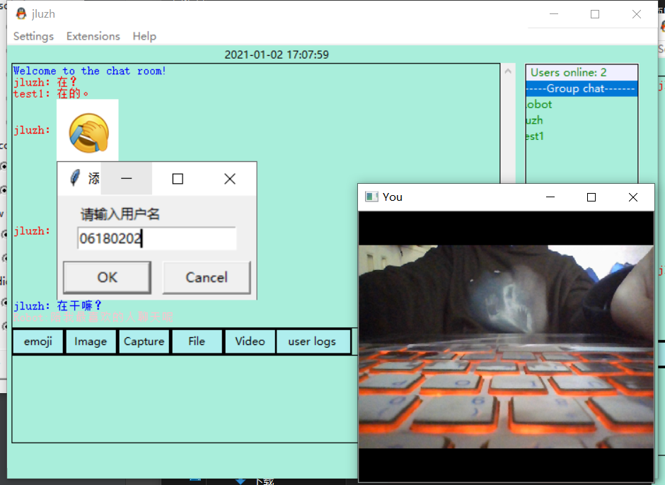

# TalkingRoom

## 参考资料：

- 参考一，基于此逻辑关系进行改进，侵权立删。[The-chat-room](https://github.com/11ze/The-chat-room) Author: 11ze
- 参考二，了解Socket的通信使用，侵权立删。[network-pj-chatroom](https://github.com/KevinWang15/network-pj-chatroom) Author: KevinWang15

## 说明：

​		首先感谢以上两位作者，在以上的参考中，引入了数据库进行Authority验证以及用户的聊天日志，爬虫进行实时疫情监控、音乐爬取，包括拓展出的背景主题更换和版本信息查询。由于时间有限，还存在这比较多的问题，例如查表的操作放在了客户端//实在是因为不够时间了，所以没有放在服务端，这是一大败笔，如果日后有时间肯定加以改善。

## 环境及使用要求：

- python==3.6.5
- git clone https://github.com/ay1Jin/TalkingRoom.git
- cd TalkingRoom
- 打开命令行，导入数据库qq.db。如果以下指令不成功，请自行查询导入数据库方法。这里db文件的字符集utf8mb4，排序规则utf8mb4_general_ci。
  - mysql -u root -p //登录数据库
  - create database qq;
  - use qq;
  - source qq.db;
- pip install -r requirements.txt

## 内容：

​		这次项目的主要驱动是学校要求的大三上学期课设，是一个模仿QQ的通讯工具。技术选型有Tkinter、Socket、Opencv、Pygame、Selenium、MySql。涵盖功能包括注册登录、基本通讯聊天、视频通话、文件传输、聊天记录、**疫情爬虫**、网易云音乐爬虫#**飙升榜**、学生信息对接官网。

## 网络结构：

## 使用详情：

1. Login & Talking

2. Video & StudentInfo

3. Covid Spider & Music Spider

4. UserLogs

## 最后更新时间

- Author: [ay1Jin](https://github.com/ay1Jin)
- Last Update: 2021-01-02 17:41​ :timer_clock:
- Tkanks.

